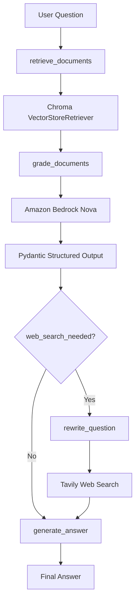
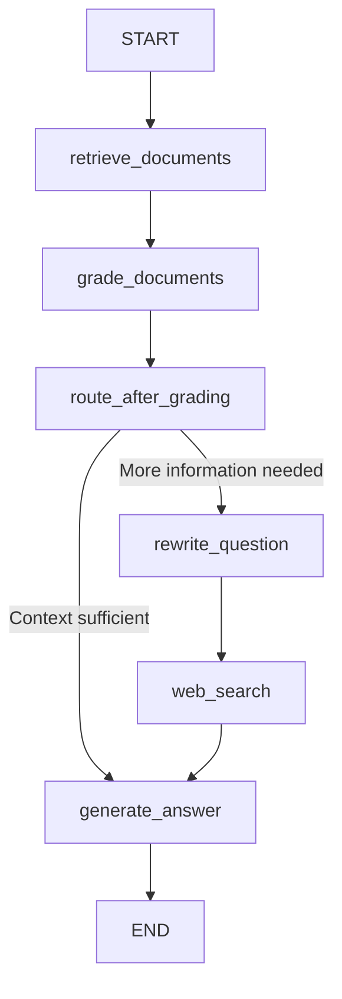
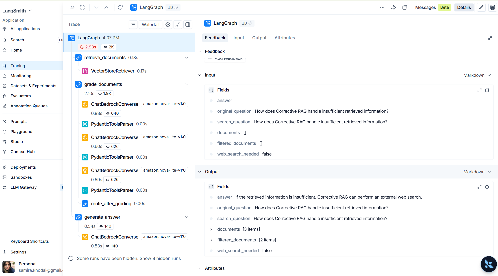

# Corrective RAG with LangGraph, Amazon Bedrock & Chroma

## Overview

This project implements a **Corrective Retrieval-Augmented Generation (Corrective RAG)** workflow using **LangGraph**, **Amazon Bedrock**, **Chroma**, and **LangSmith**.

The workflow retrieves relevant documents, evaluates their relevance with an LLM, decides whether additional retrieval is required, and generates a grounded answer.

This project was built as part of my Agentic AI learning portfolio.

---

## Architecture



## LangGraph Workflow



## LangSmith Observability

LangSmith traces document retrieval, Amazon Bedrock model calls, structured document grading, conditional routing, and final-answer generation.



## Technologies

- Python
- LangGraph
- LangChain
- Amazon Bedrock (Nova Lite)
- Amazon Titan Embeddings
- Chroma Vector Database
- LangSmith
- Pydantic
- Prompt Engineering

---

## Workflow

```text
User Question
      │
      ▼
Retrieve Documents
      │
      ▼
Grade Documents
      │
      ▼
Web Search Needed?
      │
 ┌────┴────┐
 │         │
No         Yes
 │         │
 ▼         ▼
Generate  Rewrite Question
Answer        │
              ▼
         Web Search
              │
              ▼
        Generate Answer
```

---

## LangSmith Observability

The workflow is traced with LangSmith, including document retrieval, Amazon Bedrock model calls, structured document grading, conditional routing, and final-answer generation.


## Project Structure

```text
corrective-rag/

├── app.py
├── stream_app.py
├── requirements.txt
├── README.md
│
├── src/
│   ├── graph.py
│   ├── graph_state.py
│   ├── llm.py
│   ├── models.py
│   ├── nodes.py
│   ├── prompts.py
│   ├── sample_data.py
│   └── vector_store.py
│
├── tests/
│
└── .gitignore
```

---

## Features

- LangGraph workflow orchestration
- Shared GraphState
- Semantic retrieval using Chroma
- Document grading using Amazon Bedrock
- Question rewriting
- Conditional routing
- Final answer generation
- Streaming execution
- LangSmith tracing
- Component testing

---

## Example Question

```
How does Corrective RAG handle insufficient retrieved information?
```

Example Answer

```
If the retrieved information is insufficient,
Corrective RAG performs an external web search
to retrieve additional relevant information.
```

---

## Evaluation and Optimization

The Corrective RAG pipeline was evaluated at both the retrieval and final-answer stages using Amazon Bedrock.

### Retrieval Evaluation

Retrieval quality was evaluated by using an LLM grader to determine whether the retrieved CAQH document chunks contained useful evidence for answering each question.

| Configuration | Average Retrieval Score |
| ------------- | ----------------------: |
| k = 3         |                2.33 / 3 |
| k = 5         |                3.00 / 3 |

Increasing the number of retrieved chunks from 3 to 5 improved retrieval quality on the evaluation set.

### Answer Evaluation

Generated answers were compared with expected answers using a structured Bedrock evaluator.

| Configuration              | Average Answer Score |
| -------------------------- | -------------------: |
| Initial generation prompt  |             2.40 / 3 |
| Improved generation prompt |             3.00 / 3 |

The generation prompt was improved to encourage complete answers that include important supporting details from the retrieved context.

### Holdout Evaluation

The optimized configuration was then tested against a separate set of questions that were not used during tuning.

**Holdout score: 3.00 / 3**

Final configuration:

- Top 5 retrieved chunks
- Amazon Titan embeddings
- Chroma vector store
- Bedrock Nova for document grading and answer generation
- LLM-based retrieval and answer evaluation

The evaluation set is intentionally small and the evaluator is LLM-based, so these results should be interpreted as project-level validation rather than a claim of universal accuracy.

Detailed results are available in `docs/evaluation_results.md`.

## Future Improvements

The current project already includes real PDF ingestion, chunking, semantic retrieval, LLM-based document grading, retrieval evaluation, answer evaluation, prompt optimization, holdout testing, and LangSmith tracing.

The next improvements are:

- Expand the evaluation dataset with more difficult and diverse questions
- Add unsupported-question and hallucination testing
- Add faithfulness evaluation to verify that answers stay grounded in retrieved context
- Add retrieval precision and recall metrics
- Compare different chunk sizes and chunk overlaps
- Compare retrieval strategies such as similarity search and MMR
- Add reranking for retrieved chunks
- Support multiple healthcare documents and PDFs
- Add metadata-based filtering
- Add conversation memory
- Expose the LangGraph workflow through a FastAPI REST API
- Containerize the application with Docker
- Deploy the application on AWS
- Add CI/CD with GitHub Actions
- Add production monitoring, latency tracking, and cost monitoring

---

## Author

**Samira Khodai**

AI / Machine Learning Engineer

This repository is part of my Agentic AI portfolio built while learning LangGraph, Amazon Bedrock, Retrieval-Augmented Generation (RAG), and production AI workflows.
