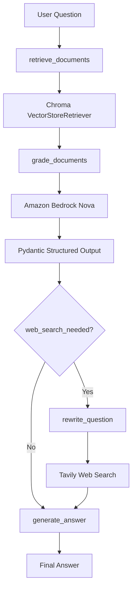
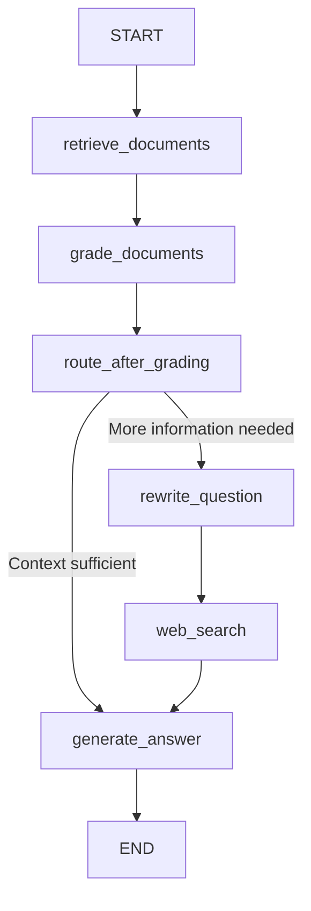

# Corrective RAG with LangGraph, Amazon Bedrock & Chroma

## Overview

This project implements a **Corrective Retrieval-Augmented Generation (Corrective RAG)** workflow using **LangGraph**, **Amazon Bedrock**, **Chroma**, and **LangSmith**.

The workflow retrieves relevant documents, evaluates their relevance with an LLM, decides whether additional retrieval is required, and generates a grounded answer.

This project was built as part of my Agentic AI learning portfolio.

---

## Architecture



## LangGraph Workflow



## Technologies

- Python
- LangGraph
- LangChain
- Amazon Bedrock (Nova Lite)
- Amazon Titan Embeddings
- Chroma Vector Database
- LangSmith
- Pydantic
- Prompt Engineering

---

## Workflow

```text
User Question
      │
      ▼
Retrieve Documents
      │
      ▼
Grade Documents
      │
      ▼
Web Search Needed?
      │
 ┌────┴────┐
 │         │
No         Yes
 │         │
 ▼         ▼
Generate  Rewrite Question
Answer        │
              ▼
         Web Search
              │
              ▼
        Generate Answer
```

---

## LangSmith Observability

The workflow is traced with LangSmith, including document retrieval, Amazon Bedrock model calls, structured document grading, conditional routing, and final-answer generation.


## Project Structure

```text
corrective-rag/

├── app.py
├── stream_app.py
├── requirements.txt
├── README.md
│
├── src/
│   ├── graph.py
│   ├── graph_state.py
│   ├── llm.py
│   ├── models.py
│   ├── nodes.py
│   ├── prompts.py
│   ├── sample_data.py
│   └── vector_store.py
│
├── tests/
│
└── .gitignore
```

---

## Features

- LangGraph workflow orchestration
- Shared GraphState
- Semantic retrieval using Chroma
- Document grading using Amazon Bedrock
- Question rewriting
- Conditional routing
- Final answer generation
- Streaming execution
- LangSmith tracing
- Component testing

---

## Example Question

```
How does Corrective RAG handle insufficient retrieved information?
```

Example Answer

```
If the retrieved information is insufficient,
Corrective RAG performs an external web search
to retrieve additional relevant information.
```

---

## Future Improvements

- PDF ingestion
- Automatic chunking
- Metadata filtering
- RAG evaluation metrics
- FastAPI deployment
- Docker
- AWS deployment
- Conversation memory

---

## Author

**Samira Khodai**

AI / Machine Learning Engineer

This repository is part of my Agentic AI portfolio built while learning LangGraph, Amazon Bedrock, Retrieval-Augmented Generation (RAG), and production AI workflows.
